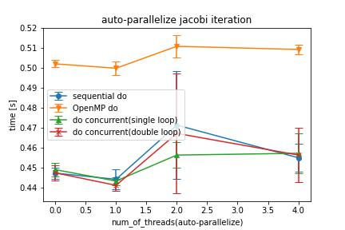
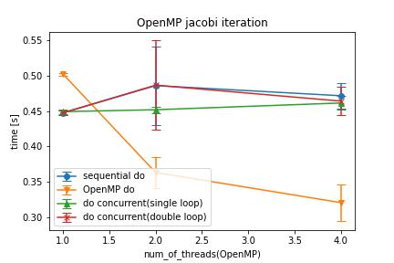
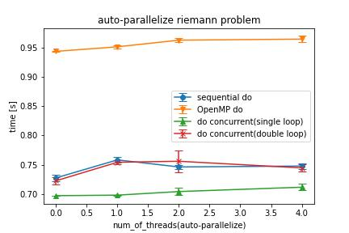
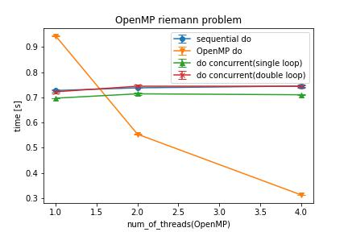

# fortran_parallel_03

1/15 に行う並列計算勉強会の資料

1 次元配列の要素ごとの操作を行うテストを`one_dimensional`ディレクトリに

2 次元配列を用いるテストを`two_dimensional`ディレクトリに

## コンパイル&実行方法

`one_dimensional`あるいは`two_dimensional`ディレクトリで

```bash
$bash execution.sh
```

とすると実行されます

### パラメータ

| 変数          | 定義しているファイル | 説明                                                      |
| ------------- | -------------------- | --------------------------------------------------------- |
| nsize         | main.f90             | 配列サイズ                                                |
| nloop         | execusion.sh         | 繰り返し回数                                              |
| ntrial        | execusion.sh         | 試行回数                                                  |
| napara        | execusion.sh         | 自動並列化のスレッド数（0 なら off）                      |
| nomp          | execusion.sh         | OpenMP のスレッド数                                       |
| compiler_type | execusion.sh         | 利用するコンパイラ（gfortran など）                       |
| build_type    | execusion.sh         | debug:最適化オプションなし．fast:最適化オプションモリモリ |

### コンパイラオプション

```cmake
   set(CMAKE_Fortran_FLAGS_DEBUG   "-O0 -Wall -pedantic -std=f2008
                                    -fbounds-check -Wuninitialized
                                    -ffpe-trap=invalid,zero,overflow
                                    -fbacktrace -g -Ddebug
                                    ${omp_option} ${autopara_option}")
   set(CMAKE_Fortran_FLAGS_PROFILE "-O3 -march=narive -mtune=native -p
                                    ${omp_option} ${autopara_option}")
   set(CMAKE_Fortran_FLAGS_FAST    "-O3 -march=native -mtune=native
                                    ${omp_option} ${autopara_option}")
```

`omp_option`と`autopara_option`はそれぞれ omp.txt と apara.txt から読み込まれます（execusion.sh を実行した場合，この二つのテキストファイルは自動生成されます）

## 実行時間計測

`omp_get_wtime`を用います

nloop 回の繰り返しを ntrial 回試行して，平均と標準偏差を出力します

## one_dimensional

src/one_dimensional
一次元配列の要素ごとの和・積・商などを求めています

配列の宣言位置や，変数の型による計算時間の違いを確認します

### 記憶領域に着目して宣言位置を変化させた三種類の配列を作成

1. main で定義し，静的記憶領域(static)に置かれることを期待
2. module 内 subroutine で定義し，スタック領域(stack)に置かれることを期待
3. module 内 subroutine で allocate した，ヒープ領域(heap)に置かれることを期待

## two_dimensional

src/two_dimensional
二次元配列で隣接データを参照するような（配列構文では書きにくい？）問題

とりあえず，次の二つを実装しました
jacobi 法
roe の近似リーマン解法

### implementation

ヤコビ法を例に

```Fortran
! implementation 1 : sequential do
   do l=1,nl
      do k=2,nsize-1
         do j=2,nsize-1
            b(j,k) = 0.25d0*(a(j,k-1)+a(j-1,k)+a(j+1,k)+a(j,k+1))
         end do
      end do
   end do
! implementation 2 : OpenMP do
    do l=1,nl
      !$omp parallel do shared(a,b,nsize) private(j,k,s)
      do k=2,nsize-1
         do j=2,nsize-1
            b(j,k) = 0.25d0*(a(j,k-1)+a(j-1,k)+a(j+1,k)+a(j,k+1))
         end do
      end do
      !$omp end parallel do
   end do
! implementation 3 : do concurrent
    do l=1,nl
      do concurrent(k=2:nsize-1,j=2:nsize-1)
         b(j,k) = 0.25d0*(a(j,k-1)+a(j-1,k)+a(j+1,k)+a(j,k+1))
      end do
   end do


```

### 4 点ステンシルの jacobi 法

nsize=1000．つまり配列サイズは(1000,1000)



### Roe の近似リーマン解法

nsize=200


